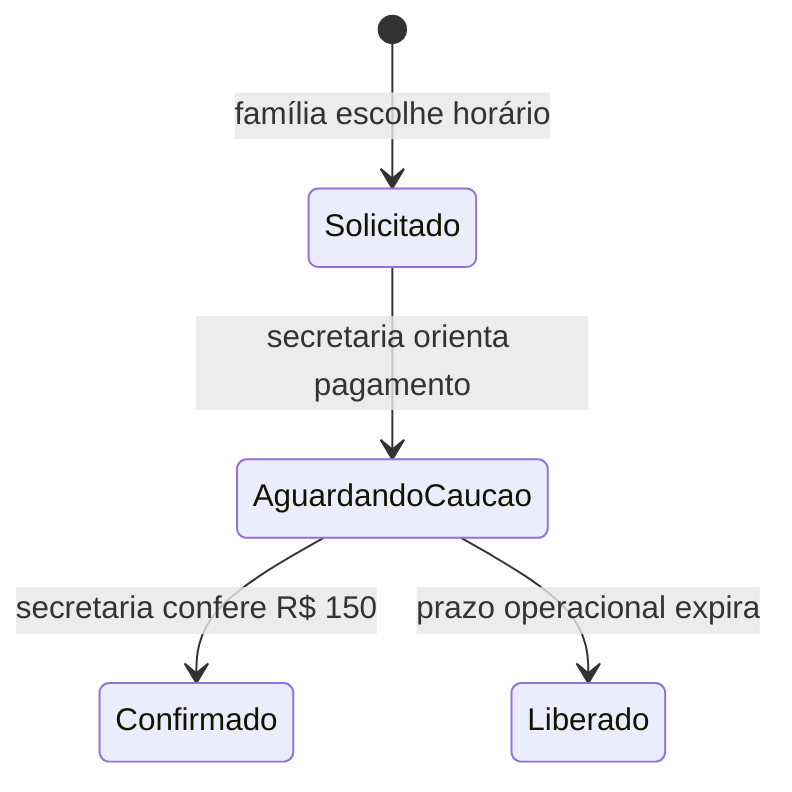

# Secretaria IA × BoaConsulta — arquitetura pública

## Finalidade

A rota pública `#/marcacao` é a porta administrativa da NeuroPed SDG. Ela incorpora a agenda oficial do BoaConsulta e orienta a família para **pré-agendar**, **remarcar/cancelar** ou **tirar dúvidas sobre caução**, sem diagnóstico, urgência clínica, prescrição, interpretação de exames ou relato clínico livre.

O fluxo é guiado por opções fechadas. A página não envia texto a um modelo de linguagem e não armazena dados de paciente.

## Fonte única da disponibilidade

O calendário é o perfil Premium oficial do Dr. Jadson Fraga, identificado pelo
slug `61e1abfa9730aa005f000743`. A porta `BoaConsultaScheduleGateway` abre esse
perfil em uma nova guia e em outro origin. Nenhum JavaScript do BoaConsulta roda
dentro do origin do NeuroPed.

A rota `#/marcacao` não consulta `/api/public-booking`. A API interna e `#/agendar` continuam existentes para o produto multi-tenant, mas não são a fonte da agenda institucional do Dr. Jadson.

## Regra operacional de 12 meses

| Regra                  | Configuração                                     |
| ---------------------- | ------------------------------------------------ |
| Dias                   | Segunda a sexta-feira                            |
| Inícios                | `09:30`, `10:30`, `11:30`, `12:30`, `13:30`      |
| Duração                | 1 hora                                           |
| Capacidade             | 5 consultas por dia útil                         |
| Período publicado      | 31/08/2026 a 31/08/2027                          |
| Exceções               | Feriados nacionais bloqueados                    |
| Consulta particular    | Valor vigente no perfil público oficial         |
| Caução                 | R$ 150, obrigatória                              |
| Confirmação automática | Desligada para particular e convênio             |
| Forma publicada        | Pagamento no local; cartão BoaConsulta desligado |

O valor da consulta não é fixado neste runbook nem no frontend. Em 01/09/2026, o painel autenticado foi registrado com R$ 800 enquanto o perfil público oficial ainda exibia R$ 750; por isso, o valor efetivamente publicado no perfil é a fonte da verdade para a família até a sincronização do BoaConsulta.

Os feriados nacionais bloqueados em dias úteis são 07/09/2026, 12/10/2026, 02/11/2026, 20/11/2026, 25/12/2026, 01/01/2027, 26/03/2027 e 21/04/2027. Os dias 15/11/2026 e 01/05/2027 caem no fim de semana e já ficam indisponíveis pela rotina semanal. Carnaval e Corpus Christi não foram incluídos porque são pontos facultativos, não feriados nacionais.

No painel do BoaConsulta, a rotina foi publicada de segunda a sexta, das 09:30 às 14:30, com duração de uma hora, até 31/08/2027. Os bloqueios de feriado cobrem a janela exibida de 08:00 às 14:30 e, portanto, incluem integralmente os cinco horários publicados.

## Estado do pré-agendamento

O aviso gerado pelo BoaConsulta registra uma solicitação. A confirmação efetiva é exclusivamente a ação manual da secretaria após a conferência da caução. O site não afirma que a caução é reembolsável nem que será descontada do valor total, pois essas condições não foram definidas.

## WhatsApp administrativo

O canal público é **Agendamento (Dr. Jadson Fraga), (87) 99105-5790**. Nesta entrega, a família recebe um botão com mensagem administrativa pré-preenchida, sem sintomas, diagnóstico ou documentação clínica.

O BoaConsulta não oferece webhook ou WhatsApp nessa conta; a integração nativa disponível é Google Calendar. Para avisos automáticos e repetidos a cada 30 minutos até a conferência, são necessários:

1. sincronização autorizada do BoaConsulta com um calendário operacional dedicado;
2. credenciais de uma conta oficial da WhatsApp Business Platform;
3. modelo de mensagem administrativa aprovado pelo provedor;
4. fila durável com idempotência, reenvio de 30 minutos e encerramento após a confirmação;
5. registro de auditoria sem dados clínicos no texto da notificação.

Não se deve automatizar cliques, raspar o painel do BoaConsulta nem abrir WhatsApp pelo navegador a cada 30 minutos. Esses caminhos são frágeis, não auditáveis e podem duplicar mensagens.

## Segurança de conteúdo

A integração não amplia `script-src` nem `connect-src`: o perfil oficial abre
em nova guia com `noopener noreferrer`. Essa separação impede que código de
terceiro leia tokens, prontuários ou o armazenamento da sessão NeuroPed. O CSP
continua permitindo scripts apenas do próprio origin.

## Critérios de aceite

| Critério        | Verificação                                                                   |
| --------------- | ----------------------------------------------------------------------------- |
| Rota pública    | `#/marcacao` abre sem PIN e sem shell clínico.                                |
| Fonte única     | A página usa `BoaConsultaScheduleGateway` e não chama `/api/public-booking`.  |
| Privacidade     | Não existem `input`, `textarea` ou campo clínico livre na Secretária IA.      |
| Regra comercial | Valor oficial e caução obrigatória de R$ 150 aparecem antes da agenda.        |
| Capacidade      | Os cinco inícios e a duração de uma hora são exibidos.                        |
| Confirmação     | A página usa “pré-agendamento” e exige conferência manual da secretaria.      |
| Isolamento      | A agenda abre em outro origin, sem script de terceiro dentro do NeuroPed.     |
| CSP             | Nenhum host BoaConsulta é liberado em `script-src` ou `connect-src`.           |

## Rollback

Reverter em conjunto o gateway da agenda, a página `marcacao.tsx`, os ajustes de navegação e os testes. No BoaConsulta, restaurar a rotina anterior somente após conferir que não há novas solicitações dependentes dos horários publicados.
