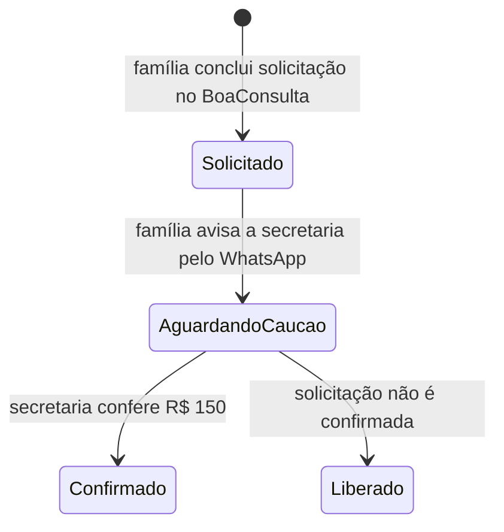

# Secretaria IA — contrato canônico consolidado

**Estado:** vigente em 01/09/2026  
**Rota institucional única:** `#/marcacao`

Este documento substitui decisões anteriores conflitantes sobre Manus, preço, agenda e confirmação da Secretaria IA institucional do NeuroPed SDG.

## 1. Fonte de verdade por domínio

| Domínio | Autoridade canônica |
| --- | --- |
| Entrada pública da Secretaria IA | `#/marcacao` no próprio NeuroPed |
| Disponibilidade e ocupação | perfil Premium oficial do BoaConsulta |
| Valor da consulta particular | **R$ 800 — valor oficial da clínica** |
| Caução | **R$ 150 — obrigatória e conferida pela secretaria** |
| Confirmação final | secretaria, após conferência da caução |
| Canal administrativo | WhatsApp Agendamento **(87) 99105-5790** |
| Agenda SaaS/multi-tenant | `#/agendar` + `/api/public-booking`, produto separado |
| Antigo site Secretaria IA no Manus | histórico, **não canônico e não usado pelo runtime** |

O BoaConsulta é autoridade apenas para **disponibilidade**. Se o parceiro exibir valor diferente durante uma sincronização, o NeuroPed mantém R$ 800 como preço oficial da clínica e orienta confirmação pelo canal administrativo antes de qualquer pagamento.

## 2. Escopo funcional

A Secretaria IA é uma porta administrativa guiada. Ela permite:

- iniciar pré-agendamento;
- consultar a agenda oficial do BoaConsulta;
- orientar remarcação/cancelamento;
- esclarecer o fluxo da caução;
- fazer o handoff BoaConsulta → WhatsApp da secretaria.

Ela não recebe sintomas, diagnóstico, exames, medicamentos, documentos clínicos ou relato livre. Não diagnostica, não prescreve e não substitui atendimento clínico.

## 3. Regra operacional publicada

| Regra | Configuração |
| --- | --- |
| Dias | segunda a sexta-feira |
| Inícios | `09:30`, `10:30`, `11:30`, `12:30`, `13:30` |
| Duração | 1 hora |
| Capacidade máxima | **até 5 consultas por dia útil** |
| Período publicado | 31/08/2026 a 31/08/2027 |
| Exceções | feriados nacionais bloqueados |
| Consulta particular | **R$ 800** |
| Caução | **R$ 150** |
| Confirmação automática | desligada |
| Forma publicada no BoaConsulta | pagamento no local; cartão BoaConsulta desligado |

Feriados nacionais bloqueados em dias úteis no período: 07/09/2026, 12/10/2026, 02/11/2026, 20/11/2026, 25/12/2026, 01/01/2027, 26/03/2027 e 21/04/2027. Os dias 15/11/2026 e 01/05/2027 caem no fim de semana e já ficam indisponíveis pela rotina semanal.

## 4. Estado do pré-agendamento

A escolha online é **pré-agendamento**. Mensagem automática do BoaConsulta, e-mail do parceiro ou abertura da agenda não equivalem à confirmação final da consulta.

## 5. Handoff BoaConsulta → WhatsApp

Ao abrir a agenda externa, o NeuroPed registra apenas estado efêmero de interface para exibir o próximo passo. Ao retornar, a família recebe CTA para enviar mensagem pré-preenchida pelo próprio WhatsApp. Assim, o número de contato chega à secretaria sem criar formulário adicional no NeuroPed.

Mensagem administrativa não deve carregar conteúdo clínico.

## 6. Separação de produtos

`#/marcacao` é a única Secretaria IA institucional do Dr. Jadson dentro do NeuroPed.

`#/agendar` e `/api/public-booking` continuam existentes porque pertencem ao produto genérico multi-tenant. Eles não devem ser usados como fonte da agenda institucional, nem receber o rótulo de Secretaria IA do Dr. Jadson.

A antiga Secretaria IA publicada no Manus é apenas evidência histórica. Não deve reaparecer em navegação, iframe, CTA ou fallback da jornada institucional.

## 7. Segurança e LGPD

- BoaConsulta abre em outra origem com `noopener noreferrer`.
- Nenhum script do BoaConsulta roda dentro da sessão NeuroPed.
- CSP não libera hosts BoaConsulta em `script-src` ou `connect-src`.
- Nenhum input ou textarea clínico existe em `#/marcacao`.
- Nenhum secret, chave Pix, token ou dado de paciente fica no frontend.
- A rota institucional não chama `/api/public-booking`.

## 8. Automação recorrente de WhatsApp

O reenvio automático a cada 30 minutos **não está ativo e não deve ser simulado**. O bloqueio externo canônico está em:

`docs/audits/BLOCKED_EXTERNAL_SECRETARIA_WHATSAPP_2026-09-01.md`

Para ativá-lo de forma confiável são necessários: WhatsApp Business Platform, template administrativo aprovado, credenciais em secrets, evento idempotente de novo pré-agendamento, fila durável e condição de encerramento após conferência/acknowledgement.

Não automatizar cliques, não raspar o painel do BoaConsulta e não usar automação de navegador como substituto de webhook/evento confiável.

## 9. Critérios de aceite

- `#/marcacao` abre como rota pública própria, sem shell clínico.
- Navegação principal aponta para uma única `Secretaria IA`.
- O hub de integrações/Manus não duplica a Secretaria IA.
- A página exibe R$ 800, caução de R$ 150 e “até 5 pacientes por dia útil”.
- Disponibilidade vem do BoaConsulta; preço não.
- Handoff BoaConsulta → WhatsApp é explícito.
- Confirmação final permanece manual.
- Nenhum texto livre clínico é coletado.
- Testes de rota, CSP, build, lint, acessibilidade e release permanecem verdes.

## 10. Rollback

Reverter em conjunto `client/src/pages/marcacao.tsx`, `client/src/components/BoaConsultaScheduleWidget.tsx`, navegação relacionada e testes da Secretaria IA. Não restaurar o antigo site Manus como fallback. Alterações no BoaConsulta devem ser revertidas apenas após conferir solicitações já existentes.
