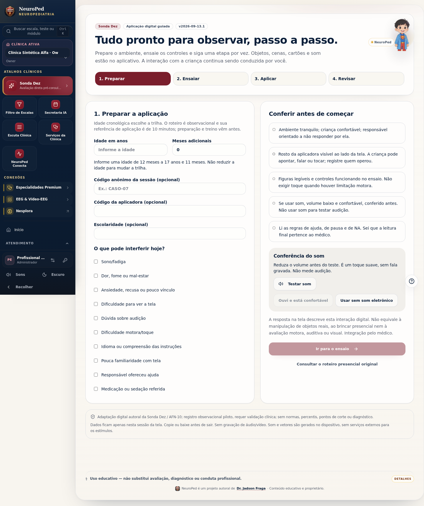
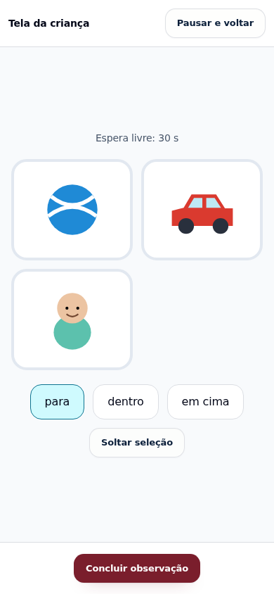

# Sonda Dez — aplicação digital guiada

Versão funcional: `2026-09-13.1`. Base auditada: `be5402d2559c8cb1f50ad6fd7c18307aa429152b`.
Rastreamento: [issue #869](https://github.com/jadsonfraga/neuroped/issues/869).

Estado: implementada para revisão. Requer validação clínica. Merge e publicação não fazem parte desta entrega.

## Problema e solução

A rota `/testes-diretos` reunia um formulário presencial, uma biblioteca visual avulsa e um guia em overlay. A aplicadora precisava providenciar objetos, escolher estímulos fora da missão e completar instruções não especificadas. A biblioteca tinha séries exibidas como grades e não assegurava a apresentação de cada oportunidade.

A entrada padrão passa a ser uma modalidade digital autoral: preparação, ensaio de controles, cinco exemplos de registro com feedback, aplicação em etapas e revisão/exportação. O roteiro presencial original continua acessível antes da sessão. Seu conteúdo foi extraído para uma fonte de dados reutilizável e comparado por igualdade profunda às 42 missões da main de base: conteúdo preservado.

| Trilha | Missões | Etapas guiadas |
| --- | ---: | ---: |
| 12–23 meses | 7 | 13 |
| 24–35 meses | 7 | 16 |
| 3–4 anos | 7 | 19 |
| 5–7 anos | 7 | 10 |
| 8–11 anos | 7 | 8 |
| 12–17 anos | 7 | 10 |
| Total | 42 | 76 |

Cada etapa contém frase, ações da aplicadora, observações esperadas e estímulo diretamente associado. Instruções e interpretação permanecem fora da tela da criança. Cartões verbais se destinam à aplicadora, que mantém a tela fora da visão da criança e lê as palavras. Listas de memória também permanecem no roteiro privado; não se usa voz remota ou reconhecimento automático.

## Recursos presentes

- Mesa com bola, carro, bebê, colher, copo, telefone, caixa, banana e tamanhos; seleção, relação e destino com representação visual e registro do movimento.
- Caixa virtual fechada e liberação pela aplicadora; dois recipientes e duas escolhas de busca visual; modelos de imitação e carro móvel.
- Cenas autorais de narrativa, contexto social e mensagem visualizada sem resposta.
- Séries temporizadas, uma figura por vez; 15/5 e 20/6 estímulos/alvos na atenção. Regras de inibição e mudança completas, sem exibir antecipadamente toda a série.
- Grades com marcar/desmarcar, alvo explícito e bloqueio após 60 segundos. Registro da seleção final e contagens brutas.
- Modelo de seis peças, ocultação após cinco segundos e reconstrução em painel 2D.
- Cartões de rotina e planejamento. A segunda apresentação recupera a ordem do primeiro plano e permite reorganizá-la diante do imprevisto.
- Som suave sintetizado localmente, acionado por gesto explícito e com opção de aplicação sem som eletrônico. Sem gravação, microfone, serviço de voz ou assets remotos de estímulos.

## Contrato clínico e de registro

A adaptação digital não é uma equivalência validada da aplicação com brinquedos físicos. O resultado traz versão, natureza piloto e limites. Brincar simbólico/funcional com objetos reais e entrega física de objetos não são inferidos a partir de toques: campos correspondentes permanecem NA com motivo; a interação digital é descrita nos eventos e nas notas. O painel 2D não permite inferir coordenação com blocos tridimensionais. Audição e visão não são testadas pelo app.

E, I, P, 0 e NA descrevem resposta espontânea, instrução, mediação, comportamento não demonstrado em oportunidade válida e condição não avaliável. Não há soma, normalidade, gravidade, CID, percentil ou classificação diagnóstica. A secretária recebe leitura operacional e exemplos; a integração clínica cabe ao médico.

Lacunas continuam lacunas. NA exige motivo. Números devem ser inteiros não negativos dentro dos limites de oportunidade. O registro completo exige apresentações ou motivos de não apresentação, campos válidos e revisão explícita. Registro parcial pode ser exportado, identificado como parcial e sem síntese interpretativa. Revisar a resposta invalida a confirmação anterior.

A apresentação para se a aba fica oculta ou se o navegador perde a cadência de uma série. Não são criadas exposições para preencher o intervalo perdido. Uma reapresentação preserva tentativas anteriores e as identifica na exportação, sem misturar suas respostas à série atual. Treino não entra nos registros. Os dados vivem somente em memória; copiar/baixar é explícito e uma nova sessão exige confirmar o descarte.

A referência de dez minutos é operacional, sem cronômetro que force a criança a terminar. O tempo efetivo é informado e a extensão é identificada. A aplicação pode precisar ser interrompida, adaptada ou complementada presencialmente.

## Arquitetura

- `sondaDezProtocol.ts`: fonte presencial extraída, sem alteração de conteúdo.
- `sondaDezDigital.ts`: adaptação versionada, 76 etapas, estímulos e orientações por campo.
- `sondaDezSession.ts`: validade, completude, medidas brutas, histórico e exportação.
- `sondaDezAudio.ts`: som local e liberação de recursos.
- `SondaDigitalArt.tsx`: vetores autorais estáveis, sem dependência de emojis do sistema.
- `SondaDigitalActivity.tsx`: apresentação, interações, cronômetros e eventos; diálogo nativo para isolar a área de estímulo.
- `SondaDigitalGuided.tsx`: preparação, ensaio, fluxo da aplicadora e revisão.
- Wrapper diário: entrada digital e acesso ao fluxo presencial anterior.

Nenhuma alteração de API, banco, tenant, permissões ou dados clínicos persistidos. Sem nova dependência de runtime da aplicação.

## Evidências

- `npm run check`: exit 0.
- `npm run lint`: exit 0.
- `npm run build:client`: exit 0; avisos globais de chunks grandes já existentes.
- `npm run test:sonda`: 20 testes aprovados (8 de consolidação + 12 digitais).
- `npm run test:e2e:sonda`: 6 jornadas / 42 missões / 76 etapas; exportação byte a byte; ensaio separado; viewport móvel; interrupção por atraso; revisão e reapresentação.
- `npm run test:quick-wins`: exit 0.
- `npm run test:filter`: exit 0; inclui 686 verificações de idade/queixa e sessão.
- `npm run test:clinical`: exit 0; 356 casos e 97.358 assertivas, além dos protocolos sentinela.
- `npm run test:podium`: exit 0; teto de 100 perguntas preservado.
- Acessibilidade com axe: zero violações na preparação e no diálogo de estímulos; preparação também conferida com relógio real (16 verificações aprovadas).
- `npm run audit:inventory` e `npm run audit:design`: exit 0.
- Comparação estrutural das 42 missões presenciais com a main de base: igualdade profunda confirmada.

O teste de navegador usa a API sintética local já existente apenas para o login do aplicativo. A Sonda executada é o bundle real. O relógio controlado percorre cada callback das séries; avanço abrupto é usado somente para provocar e verificar a interrupção. Não há fixtures de pacientes reais.

A CLI agent-browser não iniciou o daemon neste ambiente. A verificação foi realizada diretamente com Playwright e Chromium local; não se tratou a falha da CLI como aprovação visual.

## Prévia verificada

## Fontes e decisões de limite

[CDC — Screening for Autism Spectrum Disorder](https://www.cdc.gov/autism/diagnosis/index.html): rastreio breve não estabelece diagnóstico; avaliação integra história e observação especializada.

[American Academy of Pediatrics — School Breaks: Swap Screens for Play](https://www.healthychildren.org/English/family-life/power-of-play/Pages/swapping-play-for-screen-tme-during-school-breaks.aspx): habilidades de manipulação 2D e 3D não devem ser presumidas intercambiáveis em crianças pequenas.

A separação das modalidades e os campos NA são decisões de engenharia clínica derivadas desses limites e do caráter piloto já documentado no projeto. Essas fontes não validam a Sonda Dez nem seus estímulos digitais.

## Riscos, homologação e reversão

Risco clínico principal: interpretar destreza de interface, linguagem, familiaridade com telas ou ansiedade como habilidade geral. Mitigado por preparação, registro de interferentes, instruções, NA e proveniência explícita; permanece necessária a revisão do médico e observação de primeiras aplicações supervisionadas.

Risco técnico principal: cadência de estímulos em navegadores lentos e suspensão de aba. Há interrupção explícita, limites de tempo e histórico de tentativas. Comparabilidade entre dispositivos e aplicação presencial não é afirmada.

Antes de liberar para rotina: revisar clinicamente as frases, os estímulos e exemplos; observar a execução por uma aplicadora iniciante; confirmar som, toque, legibilidade e fadiga no dispositivo utilizado. Os testes técnicos não demonstram validade clínica ou confiabilidade entre avaliadores.

Rollback: reverter o commit desta PR. O fluxo presencial e suas definições foram preservados; não há migração de banco ou dados para desfazer. Não mesclar/publicar automaticamente.
