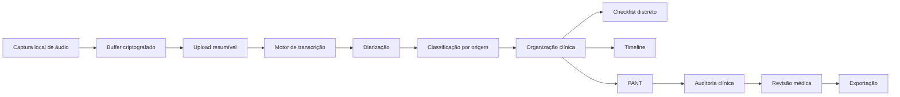

# NeuroPed Notes — Arquitetura de Referência

## 1. Decisão arquitetural

O NeuroPed existente permanece operacional. O NeuroPed Notes será desenvolvido de forma incremental, como um bounded context isolado, evitando uma reescrita de alto risco.

A primeira fase usa contratos de domínio independentes do framework. A evolução prevista é um monorepo com:

- `apps/notes-web`: Next.js, React, TypeScript, Tailwind, PWA e offline-first.
- `apps/notes-api`: NestJS, Prisma, PostgreSQL e Redis.
- `packages/notes-domain`: contratos clínicos, tipos, regras e eventos.
- `packages/notes-transcription`: adaptadores Whisper, Google, Azure e Deepgram.
- `packages/notes-ai`: organização clínica, checklist, auditoria e RAG.
- `packages/notes-security`: criptografia, autorização, auditoria e anonimização.
- `packages/notes-export`: PDF, DOCX, FHIR, JSON, Markdown e texto.
- `packages/notes-integrations`: NeuroPed, escalas, EEG, Nesplora, eye tracking, agenda e prontuário.

## 2. Princípios

1. A IA auxilia e nunca decide.
2. Inferência de IA nunca é armazenada como fato clínico.
3. Toda informação mantém origem, autor, timestamp e nível de confiança.
4. A captura de áudio deve funcionar offline e recuperar gravações interrompidas.
5. Provedores externos são substituíveis por adaptadores.
6. Dados identificáveis e conteúdo clínico são segregados.
7. Logs de auditoria são imutáveis e não armazenam áudio ou texto clínico integral.
8. Nenhuma integração externa recebe dados sem base legal, consentimento e política configurada.

## 3. Fluxo principal



## 4. Pipeline de áudio

- Captura em blocos pequenos no navegador.
- Persistência local criptografada via IndexedDB.
- Manifesto de chunks com hash e sequência.
- Upload multipart e resumível quando houver conexão.
- Chave de dados por consulta, protegida por chave mestra do tenant.
- Exclusão configurável do áudio bruto após transcrição validada.
- Recuperação idempotente após falha, fechamento da aba ou perda de rede.

## 5. Contrato de transcrição

Todos os motores implementam a mesma interface:

```ts
export interface TranscriptionProvider {
  readonly id: string;
  transcribe(input: TranscriptionInput): Promise<TranscriptionResult>;
  healthCheck(): Promise<ProviderHealth>;
}
```

A seleção do provedor ocorre por tenant, custo, idioma, disponibilidade e política de residência de dados. O domínio não conhece SDKs específicos.

## 6. Proveniência clínica

Cada fragmento deve conter:

- `sourceType`: pais, escola, terapeuta, médico, exame, escala ou IA.
- `speakerRole`: médico, paciente, mãe, pai, professor, terapeuta ou acompanhante.
- `observedAt` e `recordedAt`.
- `transcriptSpan` para rastreabilidade.
- `confidence` apenas para saídas automatizadas.
- `reviewStatus`: pendente, confirmado, corrigido ou rejeitado.

A interface deve impedir que inferências de IA apareçam visualmente como fatos confirmados.

## 7. Segurança e privacidade

- AES-256-GCM para dados em repouso na aplicação.
- TLS 1.2+ em trânsito.
- RBAC e ABAC por tenant, função, vínculo e finalidade.
- Sessões curtas, refresh rotativo e revogação.
- MFA obrigatório para administradores e recomendado para profissionais.
- Logs append-only para acesso, exportação, edição, exclusão e compartilhamento.
- Backups criptografados, testados e com política de retenção.
- Separação entre identificadores do paciente e conteúdo clínico.
- Redação automática de identificadores antes de serviços opcionais de IA.
- Política de retenção por tipo de dado e base legal.

> “HIPAA ready” não deve ser anunciado como certificação. Conformidade depende também de contratos, operação, infraestrutura, treinamento e avaliação jurídica.

## 8. Busca semântica

- PostgreSQL + pgvector.
- Embeddings opcionais e substituíveis.
- Indexação de trechos anonimizados ou pseudonimizados.
- Filtros estruturados sempre aplicados antes da similaridade vetorial.
- Controle de acesso aplicado no banco e na aplicação.
- Respostas com referência à consulta e ao trecho de origem.

## 9. Modelo de implantação

Ambientes isolados: desenvolvimento, homologação e produção.

Produção recomendada:

- Aplicação web e API em infraestrutura compatível com dados sensíveis.
- PostgreSQL gerenciado com criptografia, PITR e rede privada.
- Redis privado para filas e locks, nunca como fonte de verdade.
- Object storage com versionamento e lifecycle.
- KMS para envelopamento de chaves.
- Observabilidade com métricas e traces sem conteúdo clínico.

GitHub Pages deve permanecer apenas para conteúdo público ou demonstrações sem dados reais; não é o destino do backend clínico.

## 10. Estratégia de entrega

Cada módulo terá branch e Draft PR próprios. Nenhum merge automático. Critérios mínimos:

- lint e typecheck;
- testes unitários e de integração;
- Playwright para fluxos críticos;
- revisão de segurança e acessibilidade;
- documentação atualizada;
- cobertura progressiva até 90%, sem métricas artificiais.
